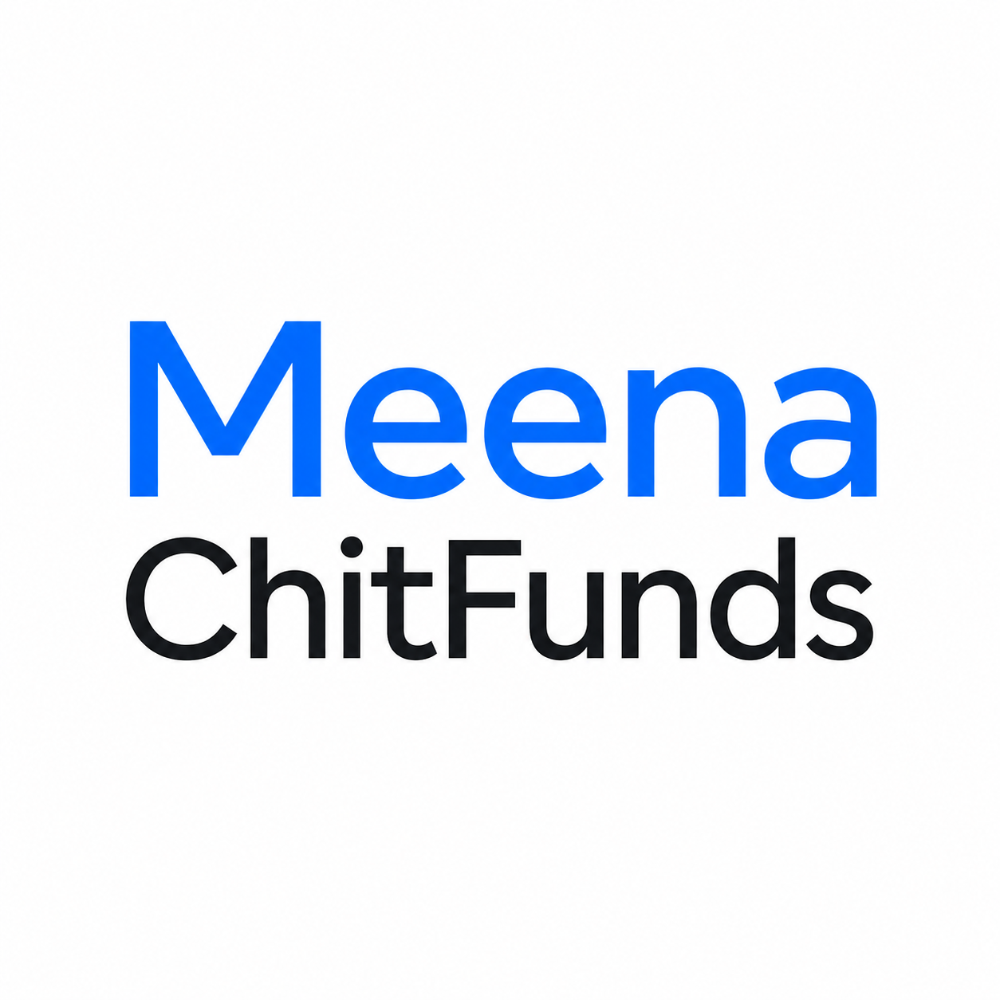

  

  # Meena Chitfunds Portal
  **A secure financial ledger and client access portal developed by Goorac Corporation.**

---

## 📌 Overview
The **Meena Chitfunds Portal** is a dedicated client access application that allows users to view their mathematical ledger breakdowns, track monthly dues, and monitor payment statuses. Developed by Goorac Corporation, it ensures complete financial transparency and accuracy for all chit fund participants.

## ✨ Key Features
*   **Secure Client Access:** Users can securely log in using their unique Client ID (e.g., M105) to view their personalized financial data.
*   **Dynamic Mathematical Ledgers:** Automatically calculates exact due amounts based on custom tier schedules and active timelines.
*   **Real-Time Status Tracking:** Visually tracks paid, pending, and upcoming monthly dues with a clear, color-coded dashboard interface.
*   **Group Management:** Supports clients enrolled in multiple fund groups, allowing seamless switching between different group ledgers.
*   **Contribution Summary:** Instantly summarizes the total duration, months paid, and the overall financial contribution (including advance payments).

## 🚀 Getting Started

> **Note:** This is a proprietary application built for Meena Chitfunds by Goorac Corporation.

### Prerequisites
*   Modern web browser (Chrome, Safari, Firefox, Edge)
*   Active Client ID provided by the chit fund administration

### Setup & Usage
Ensure all application files (including `icon.png`, `index.html`, and `config.js`) are hosted in the exact same root directory. Navigate to the application in your browser and enter your Client ID on the authentication screen to instantly access your customized ledger dashboard. 

## 🛡️ License & Copyright
**© 2026 Goorac Corporation. All Rights Reserved.**

This software is the intellectual property of Goorac Corporation, licensed exclusively for Meena Chitfunds. It may not be copied, modified, distributed, or reverse-engineered without explicit written permission from Goorac Corporation.

---
*Developed with ❤️ by Goorac Corporation.*
